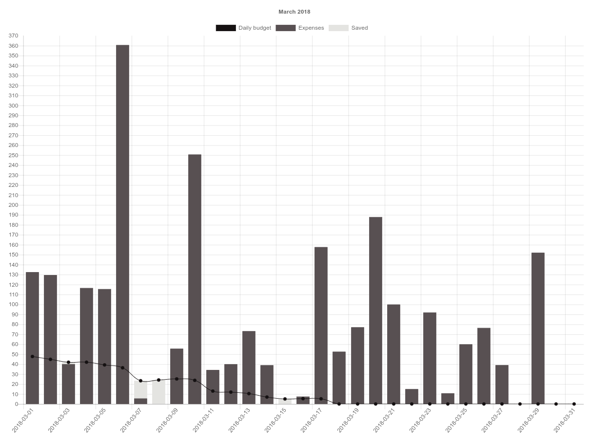

# Money Chart

## Goal

Depending on your budget for the month and your daily expenses, the project will display your daily budget for the rest of the month.

## Usage

Inside `index.html` define the following:

* Number of days in the month you want to display
* Monthly budget
* All your expenses by day for the given month